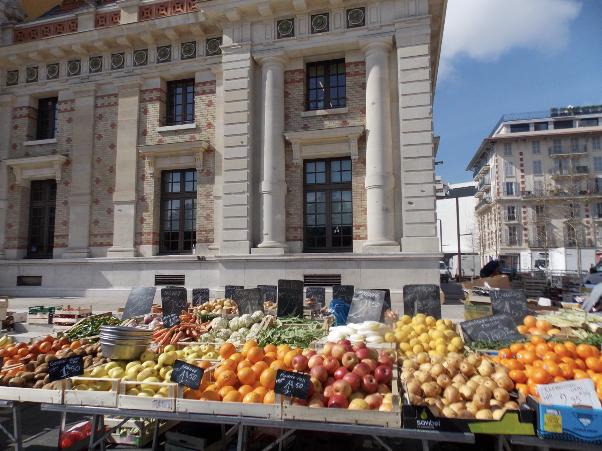
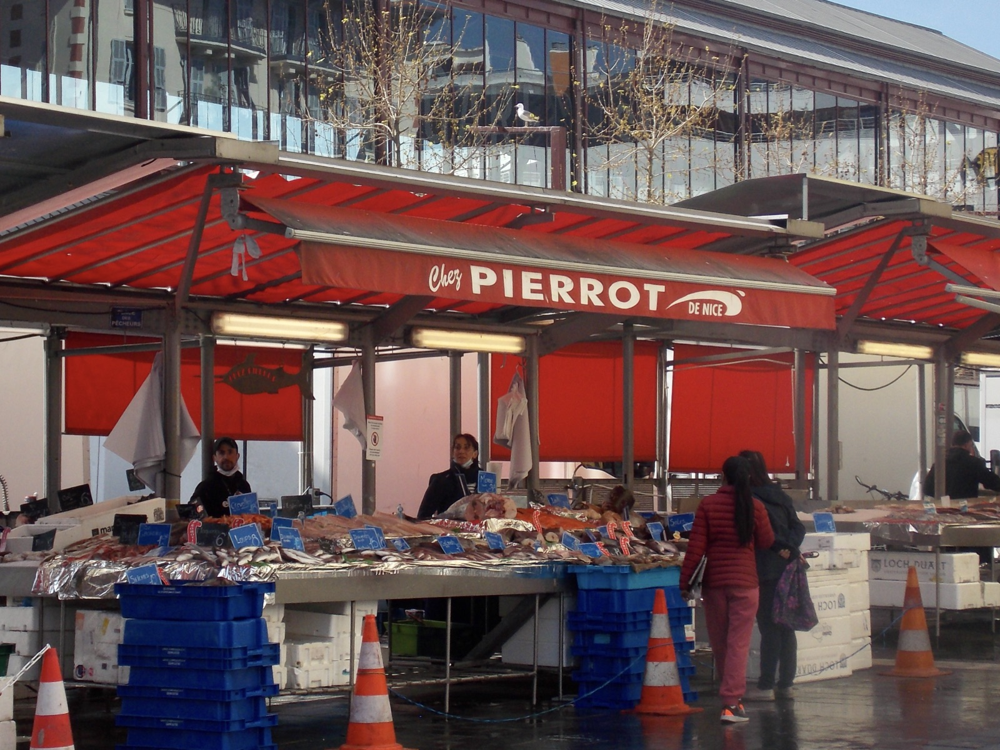
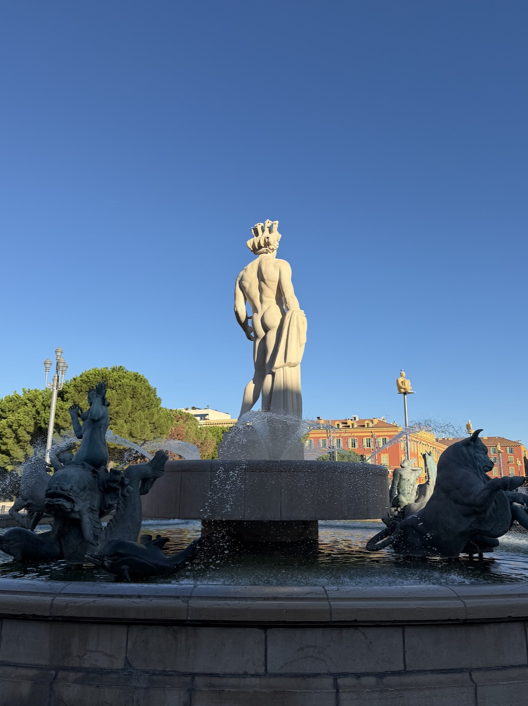
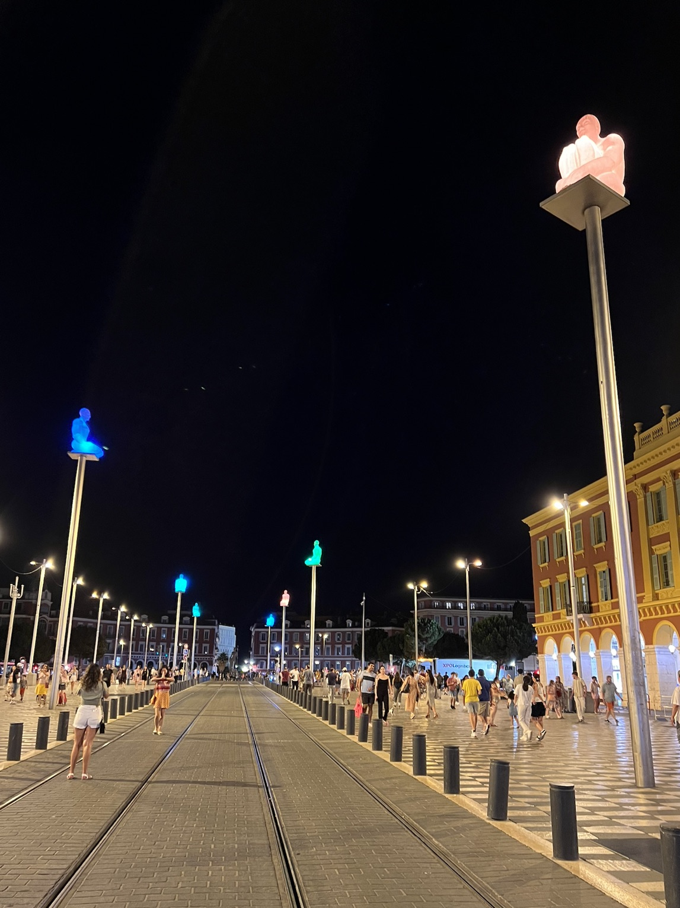
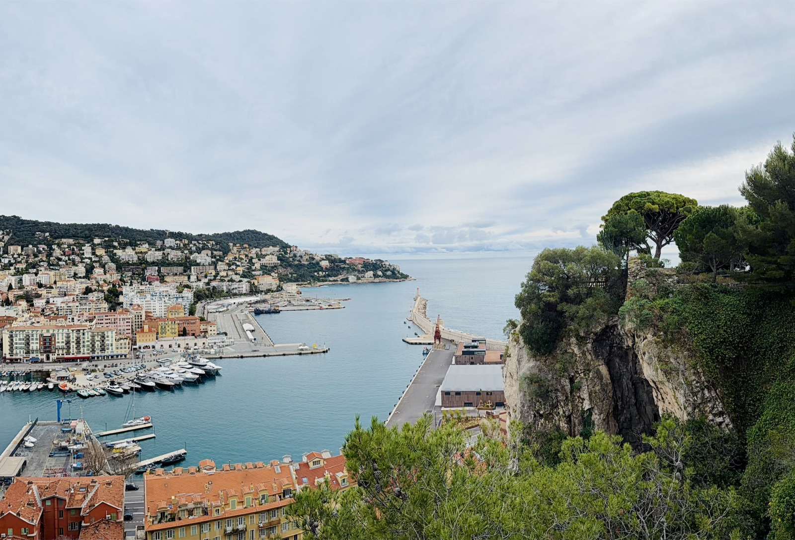

## Marché de la Libération

:::: {.columns}

::: {.column width="48%"}

:::

::: {.column width="4%"}
:::

::: {.column width="48%"}

:::

::::

::: {.mots}
animé [·]{.sep} coloré [·]{.sep} agréable
:::

## La place Masséna

:::: {.columns}

::: {.column width="48%"}

:::

::: {.column width="4%"}
:::

::: {.column width="48%"}

:::

::::

::: {.mots}
photogénique [·]{.sep} charmant [·]{.sep} attrayant
:::

## Quartier du port

::: {.mots}
authentique [·]{.sep} tranquille [·]{.sep} ravissant
:::

